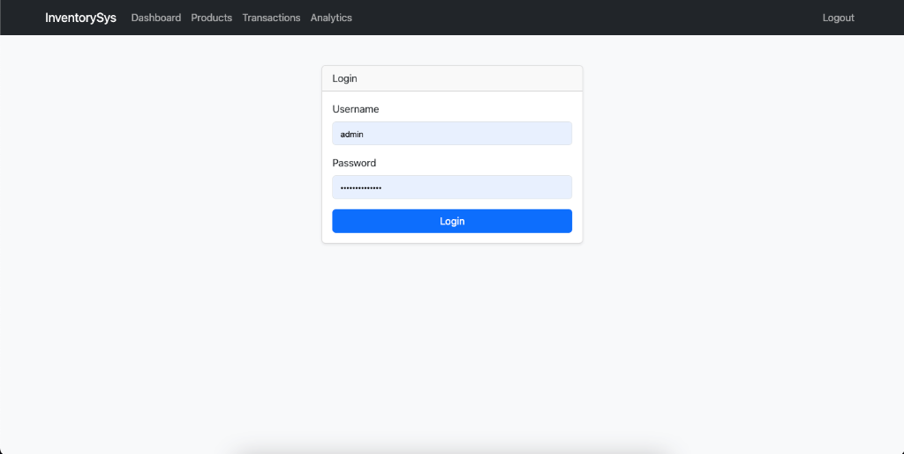
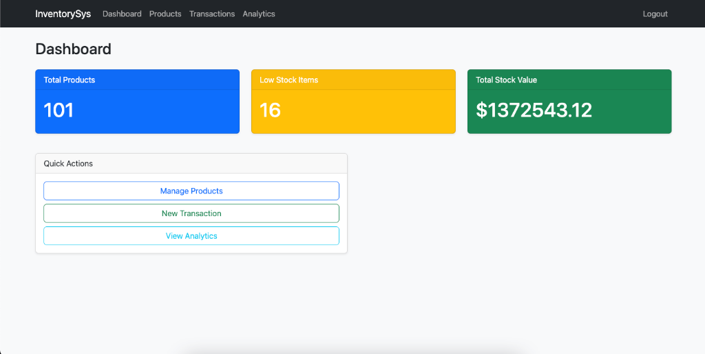
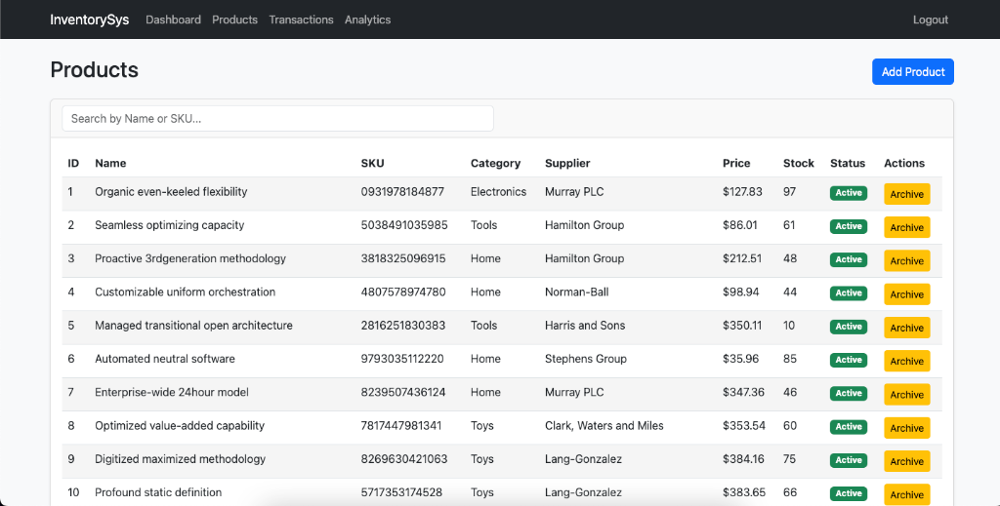
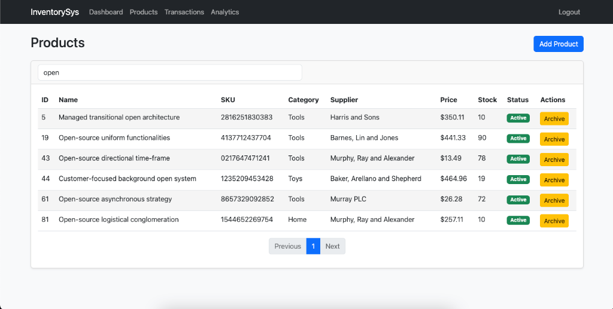
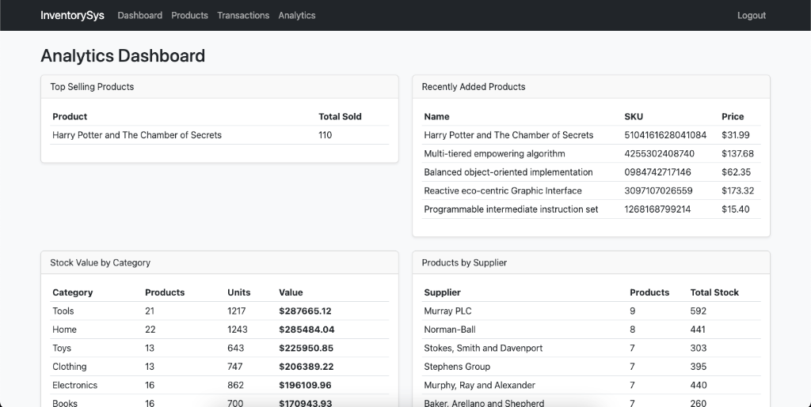

# Inventory Management System

[](https://www.python.org/downloads/)
[](https://flask.palletsprojects.com/)
[](https://www.postgresql.org/)
[](https://inventory-management-ylmu.onrender.com)
[](https://github.com/Sasaank79/Inventory-Management-System/actions)
[](LICENSE)

A production-ready inventory management system built with Flask and PostgreSQL, featuring real-time analytics, product tracking, and automated database seeding.

## 🌐 Live Demo

**https://inventory-management-ylmu.onrender.com**

> Hosted on Render free tier - first request may take 30-60 seconds (cold start)

## 📸 Screenshots

### Login


### Dashboard


### Products Management


### Product Search


### Analytics


## ✨ Key Features

- **Product Management** - CRUD operations with SKU tracking and archiving
- **Stock Transactions** - Record purchases (IN) and sales (OUT) with notes
- **Real-time Analytics** - Low stock alerts, top sellers, stock value by category
- **Supplier Tracking** - Maintain supplier relationships and contact info
- **Advanced Reporting** - Stock movement history, products by supplier
- **Secure Authentication** - JWT-based API with password hashing
- **Auto-seeding** - Generates 100 products and 20 suppliers on first deploy

## 🛠️ Tech Stack

**Backend:** Python 3.11 • Flask 3.0 • SQLAlchemy  
**Database:** PostgreSQL 15  
**Deployment:** Docker • Render  
**Testing:** pytest • GitHub Actions CI

## 🚀 Quick Start

### Run Locally with Docker

```bash
git clone https://github.com/Sasaank79/Inventory-Management-System.git
cd Inventory-Management-System
docker-compose up
```

Access at `http://localhost:5000`.

> **Note:** No default credentials are included. Use `ADMIN_USERNAME` and `ADMIN_PASSWORD` in your `.env` file or environment variables, then run the application to auto-create the admin user.

### Deploy to Render

1. Fork this repository
2. Connect to [Render](https://render.com) using the Blueprint
3. Set environment variables (`ADMIN_USERNAME`, `ADMIN_PASSWORD`)
4. Deploy automatically via `render.yaml`

See [Deployment Guide](docs/DEPLOYMENT.md) for detailed instructions.

## 📊 API Highlights

```http
POST   /auth/login              # Authenticate user
GET    /api/products            # List products (paginated)
POST   /api/transactions        # Record stock transaction
GET    /api/analytics/low-stock # Get low stock alerts
```

Full API documentation: [docs/API.md](docs/API.md) *(coming soon)*

## 🧪 Testing

[](tests/)

**35 automated tests** covering all core modules with **96% code coverage**.

```bash
# Run tests with coverage
pytest tests/ -v --cov=app

# Lint code
flake8 app/ config/ tests/
```

**Test Coverage by Module:**
| Module | Coverage |
|--------|----------|
| Auth & Security | 100% |
| Products API | 99% |
| Suppliers API | 100% |
| Analytics API | 93% |
| Transactions | 85% |

## 📁 Project Structure

```
app/
├── routes/          # API endpoints (auth, products, analytics)
├── models.py        # SQLAlchemy models
└── templates/       # Frontend HTML

config/              # Environment-based settings
tests/               # pytest test suite
render.yaml          # Deployment blueprint
```

## 📝 License

MIT License - see [LICENSE](LICENSE) file

## 🔗 Links

- **Live Demo:** https://inventory-management-ylmu.onrender.com
- **Documentation:** [docs/](docs/)
- **Issues:** [GitHub Issues](https://github.com/Sasaank79/Inventory-Management-System/issues)

---

**Built by [Sasaank79](https://github.com/Sasaank79)**
